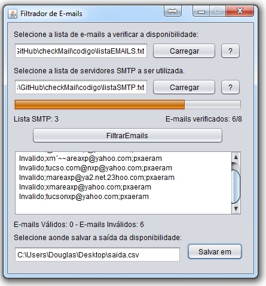

checkMail
=========

Pequeno aplicativo criado com a intenção de verificar e-mails válidos e seus passwords, simplificadamente o que este aplicativo faz é percorrer uma lista de e-mails e senhas separados por virgula e tentar se conectar a eles, caso a conexão seja bem sucedida este é marcado como válido caso contrário inválido, uma lista de smtp's também se faz necessária, afim de filtrar e-mails apenas de um domínio por exemplo. Programa criado em meados de 2007 afim de verificar a integridade de uma lista de e-mails baixada na internet.

